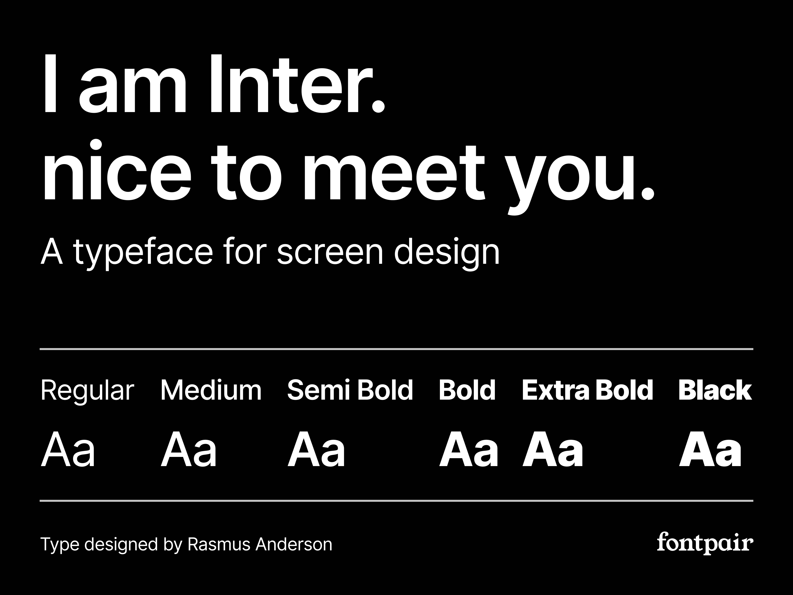
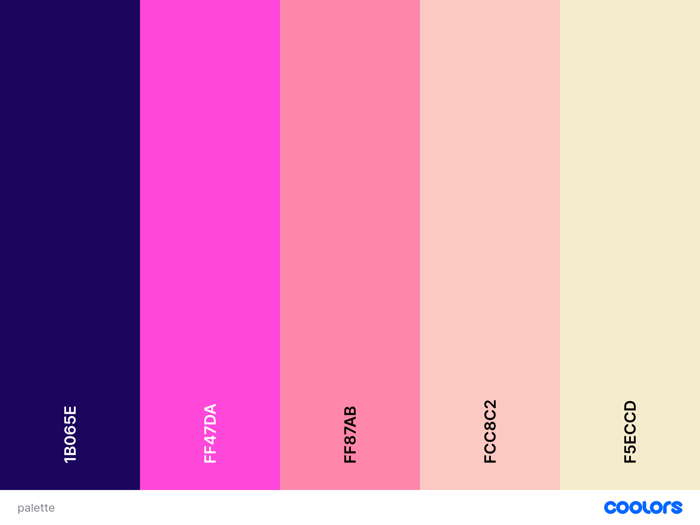

<div align="center">
  
</div>
<div align="center">
  
</div>

[Git Commit Generator](https://git.netgurusolutions.com) is a powerful tool designed to streamline the process of generating commit messages and README.md files for your projects. The application offers a seamless way to manage your GitHub workflows, including automated message generation based on the selected templates or custom inputs.

## Table of Contents
1. <details open>
    <summary><a href="#ux">UX</a></summary>

    <ul>
    <li><details>
    <summary><a href="#goals">Goals</a></summary>

    - [Visitor Goals](#visitor-goals)
    - [Business Goals](#business-goals)
    - [User Stories](#user-stories)
    </details></li>

    <li><details>
    <summary><a href="#visual-design">Visual Design</a></summary>

    - [Wireframes](#wireframes)
    - [Fonts](#fonts)
    - [Icons](#icons)
    - [Colors](#colors)
    - [Images](#images)
    - [Styling](#styling)
    </details></li>
    </ul>
</details>

2. <details open>
    <summary><a href="#features">Features</a></summary>

    <ul>
    <li><details>
    <summary><a href="#page-elements">Page Elements</a></summary>

    - [All Pages](#all-pages)
    - [Index Page](#index-page)
    - [Generator Page](#generator-page)
    - [Settings Page](#settings-page)
    </details></li>

    <li><details>
    <summary><a href="#additional-features">Additional Features</a></summary>

    - [Theme Toggle](#theme-toggle)
    - [API Integration](#api-integration)
    </details></li>

    <li><details>
    <summary><a href="#feature-ideas">Feature Ideas</a></summary>

    - [Future Enhancements](#future-enhancements)
    - [Additional Templates](#additional-templates)
    </details></li>
    </ul>
</details>

3. <details open>
    <summary><a href="#technologies-used">Technologies Used</a></summary>

    - [Languages](#languages)
    - [Frameworks](#frameworks)
    - [Libraries](#libraries)
    - [APIs](#apis)
    - [Platforms](#platforms)
    - [Other Tools](#other-tools)
</details>

4. <details open>
    <summary><a href="#testing">Testing</a></summary>

    <ul>
    <li><details>
    <summary><a href="#methods">Methods</a></summary>

    - [Validation](#validation)
    - [General Testing](#general-testing)
    - [Mobile Testing](#mobile-testing)
    - [Desktop Testing](#desktop-testing)
    </details></li>

    <li><details>
    <summary><a href="#bugs">Bugs</a></summary>

    - [Known Bugs](#known-bugs)
    - [Fixed Bugs](#fixed-bugs)
    </details></li>
    </ul>
</details>

5. <details open>
    <summary><a href="#deployment">Deployment</a></summary>

    <ul>
    <li><details>
    <summary><a href="#local-deployment">Local Deployment</a></summary>

    - [Local Preparation](#local-preparation)
    - [Local Instructions](#local-instructions)
    </details></li>

    <li><details>
    <summary><a href="#github-deployment">Github Deployment</a></summary>

    - [Github Preparation](#github-preparation)
    - [Github Instructions](#github-instructions)
    </details></li>
    </ul>
</details>

6. <details open>
    <summary><a href="#credit-and-contact">Credit and Contact</a></summary>

    - [Content](#content)
    - [Contact](#contact)
</details>

----

# UX
## Goals
### Visitor Goals
The target audience for Git Commit Generator includes:
- Developers who need to streamline the process of writing commit messages.
- Project managers who want to standardize commit messages across a team.
- Open-source contributors who wish to maintain high-quality documentation and commit history.

User goals are:
- Generate accurate and concise commit messages quickly.
- Create detailed and structured README.md files based on the project details.
- Manage themes and settings for a personalized experience.

Git Commit Generator fills these needs by:
- Providing a simple and intuitive interface to generate commit messages.
- Offering various templates to guide the user in creating comprehensive documentation.
- Enabling theme customization to match the user's preference.

### Business Goals
The Business Goals of Git Commit Generator are:
- Enhance productivity by reducing the time spent on writing commit messages.
- Promote best practices in software development by standardizing commit messages.
- Foster a strong community by providing tools that cater to developers' needs.

### User Stories
1. As a developer, I want to quickly generate meaningful commit messages without spending too much time.
2. As a project manager, I want to ensure that all team members follow the same commit message format.
3. As an open-source contributor, I want to maintain a clear and concise commit history that is easy for others to understand.

## Visual Design
### Wireframes
[Wireframes for Git Commit Generator](https://www.figma.com/design/Yg5RQhY7G6bDtyxGtLcuvn/git-commit-gen?node-id=1-2&t=Kgd09Z48xGYlijDS-1)

### Fonts
<div align="center">
  
</div>

- The primary font is [Inter](https://fonts.google.com/specimen/Inter) for its readability and modern look.
- Icons are sourced from [Lucide](https://lucide.dev/) for their clean and simple design.

### Colors
<div align="center">
  
</div>

- The color scheme is neutral with accents that align with the overall minimalist design.

### Images
- Placeholder images have been used where applicable, which the user can later replace with their own content.

### Styling
- The project utilizes Tailwind CSS for styling, with custom classes applied for consistency across the app.

----

# Features
## Page Elements
### All Pages
#### Navbar
- The Navbar is fixed at the top and contains links to the main sections of the app, including the Generator, Settings, and Documentation.

#### Footer
- The Footer contains links to the GitHub repository, contact information, and social media accounts.

### Index Page
#### Introduction
- The Index Page introduces the app and provides quick links to start generating commit messages or read the documentation.

### Generator Page
- The Generator Page contains the form that allows users to input details and select templates for generating commit messages and README.md files.

### Settings Page
- The Settings Page includes options for theme customization and managing user preferences.

### Additional Features
#### Theme Toggle
- Users can switch between light, dark, and system themes using the ModeToggle component.

#### API Integration
- The app integrates with the GitHub API to fetch repository details and improve the commit message generation process.

----

# Technologies Used
## Languages
- [TypeScript](https://www.typescriptlang.org/) for functionality.
- [CSS](https://developer.mozilla.org/en-US/docs/Web/CSS) for styling.
- [HTML](https://developer.mozilla.org/en-US/docs/Web/HTML) for structure.

## Frameworks
- [Next.js](https://nextjs.org/) for building the React application.
- [Tailwind CSS](https://tailwindcss.com/) for styling.

## Libraries
- [React](https://reactjs.org/) for building the UI.
- [Lucide Icons](https://lucide.dev/) for iconography.
- [Next Themes](https://github.com/pacocoursey/next-themes) for theme management.
- [Shadcn UI](https://ui.shadcn.com)

## Platforms
- [GitHub](https://github.com/) for version control and repository management.
- [Azure](https://azure.microsoft.com/en-us/) for deployment.

## Other Tools
- [Visual Studio Code](https://code.visualstudio.com/) for development.
- [Figma](https://www.figma.com/) for design and wireframes.

----

# Testing
## Methods
### Validation
- HTML and CSS have been validated using standard web validation tools.

### General Testing
- Each feature has been tested across multiple devices to ensure compatibility.

### Mobile Testing
- The app has been tested on both iOS and Android devices.

### Desktop Testing
- The app has been tested on various desktop browsers, including Chrome, Firefox, and Safari.

## Bugs
### Known Bugs
- Occasionally, theme changes may not apply immediately on slower devices.

### Fixed Bugs
- Fixed an issue where the ModeToggle component did not correctly switch themes.

----

# Deployment
## Local Deployment
### Local Preparation
**Requirements:**
- Node.js and Yarn installed on your machine.

### Local Instructions
1. Clone the repository: 
    ```
    git clone https://github.com/Net-Guru-Solutions/git-commit-gen
    ```
2. Navigate to the project directory:
    ```
    cd git-commit-gen
    ```
3. Install dependencies:
    ```
    yarn install
    ```
4. Run the development server:
    ```
    yarn dev
    ```

## GitHub Deployment
### GitHub Preparation
- A free GitHub account is required.

### GitHub Instructions
1. Log in to your GitHub account.
2. Create a new repository named `git-commit-gen`.
3. Push the local repository to GitHub:
    ```
    git remote add origin https://github.com/Net-Guru-Solutions/git-commit-gen.git
    git branch -M main
    git push -u origin main
    ```
4. Deploy the app using Vercel or another preferred platform.

## Credits and Contact
### Content
All content, including images and text, can be customized to fit your specific project needs. If you have any questions or need further assistance, please feel free to reach out.

### Contact
You can reach me at `info@netgurusolutions.com` or find more of my work at [Your GitHub Profile](https://github.com/Net-Guru-Solutions).
